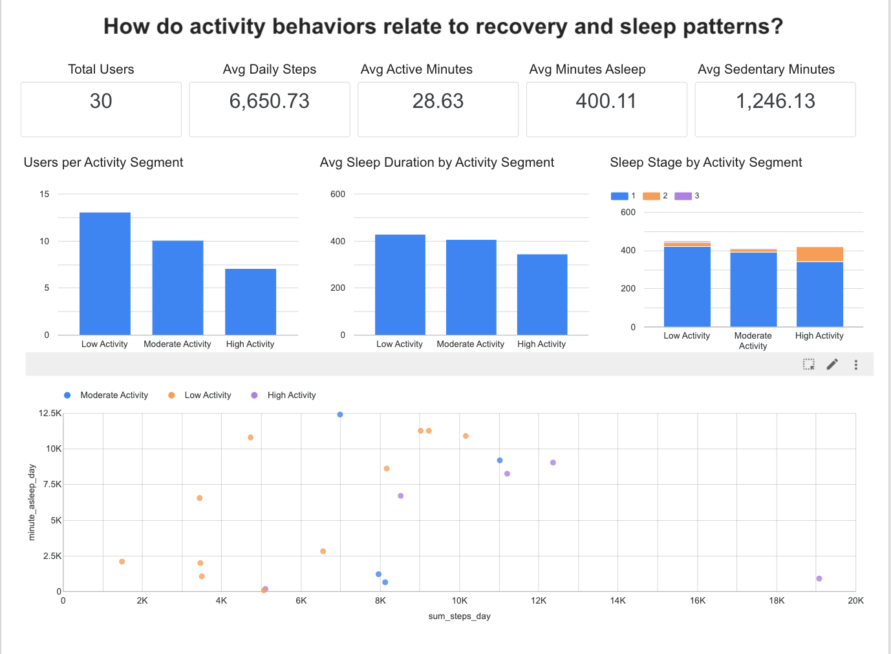

# wearable-fitness-behavior-analysis
Behavioral and recovery analysis of wearable fitness users using SQL, BigQuery, and Looker Studio.

# Wearable Fitness Recovery & Activity Analysis

## Overview
This project explored behavioral patterns in wearable fitness users to understand how activity levels relate to sleep duration, recovery behavior, and engagement trends.

The analysis focused on segmenting users into low, moderate, and high activity groups using wearable fitness data and SQL-based behavioral analysis.

## Business Question
How do activity behaviors relate to recovery and sleep patterns in wearable fitness users?

## Tools Used
- SQL
- BigQuery
- Looker Studio
- Kaggle Dataset

## Methodology
The dataset included daily activity metrics, sleep tracking data, and step intensity metrics.

SQL views were created to:
- segment users by activity level
- analyze sleep quantity
- evaluate sleep stage distribution

Users were categorized into:
- Low Activity
- Moderate Activity
- High Activity

based primarily on average daily step counts.

## Dashboard

[Interactive Looker Studio Dashboard](https://datastudio.google.com/s/r9Pv56HozZY)

## Key Findings

### 1. Low-to-moderate activity users represented the majority of the population

Most users fell into the low and moderate activity segments, indicating the greatest opportunity for engagement initiatives exists among less active users rather than highly active users.

### 2. Higher activity did not correspond to longer sleep duration

Users in the high activity segment averaged fewer minutes asleep than low activity users, suggesting total sleep duration alone may not fully explain recovery outcomes.

### 3. Recovery patterns differed across activity segments

Sleep stage distributions varied across activity groups, indicating that activity behavior may influence recovery quality differently than overall sleep duration.

### 4. Behavioral data can support personalized wellness experiences

Differences in activity and recovery patterns suggest opportunities to deliver:

- Personalized recovery recommendations
- Adaptive engagement features
- Activity-specific wellness insights

## Future Improvements
Potential future enhancements include:
- A/B testing analysis
- retention analysis
- heart rate recovery modeling
- personalized recommendation systems
